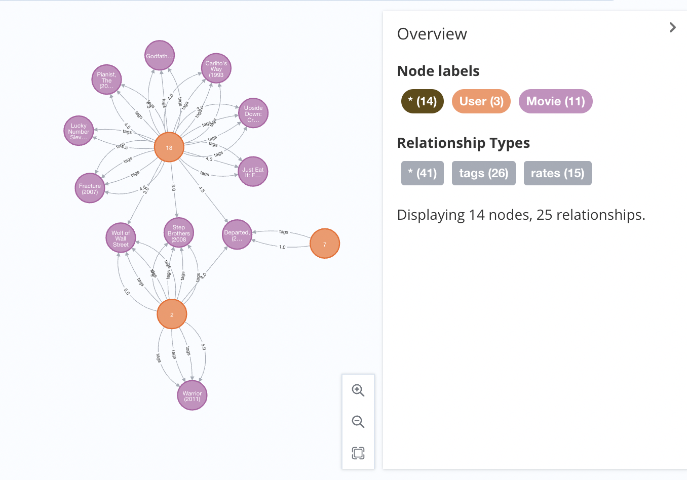
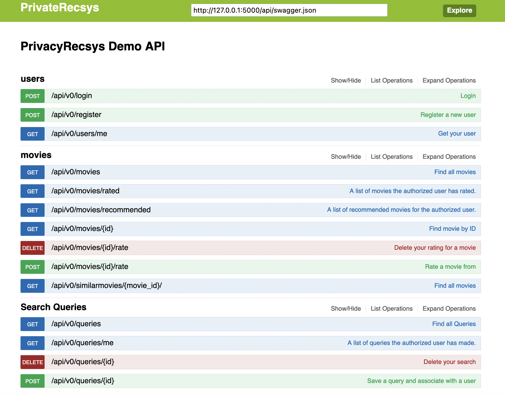
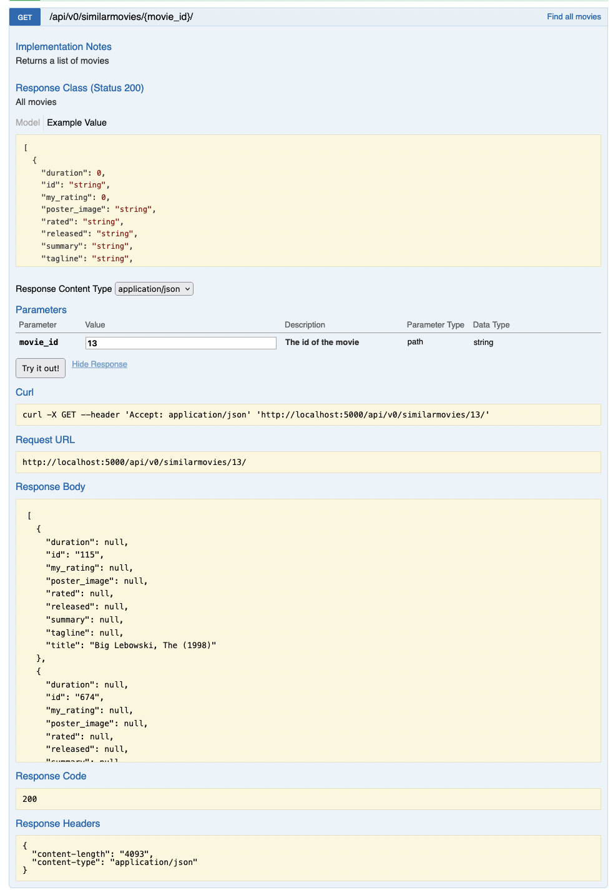
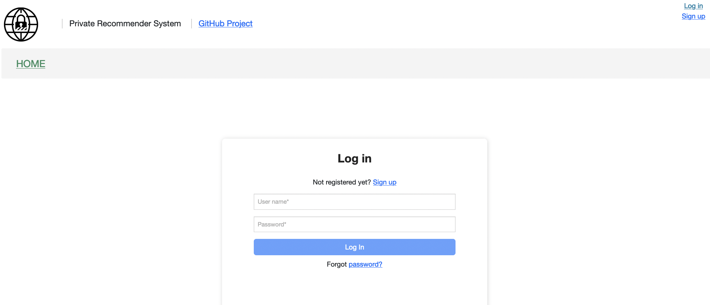
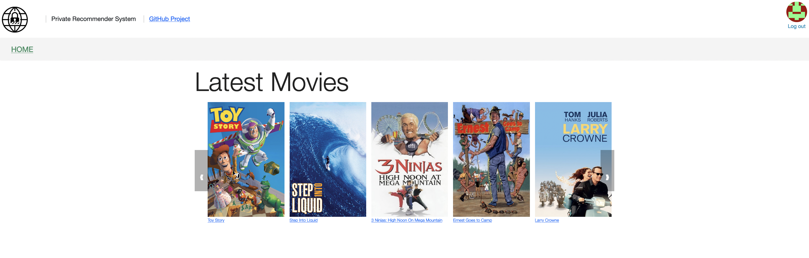
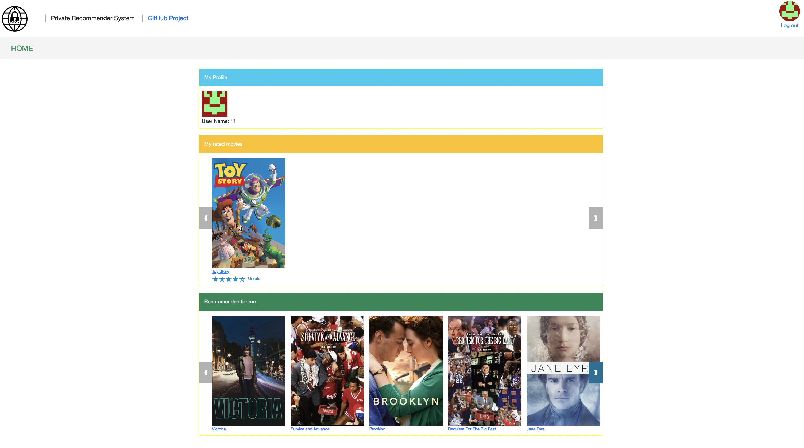
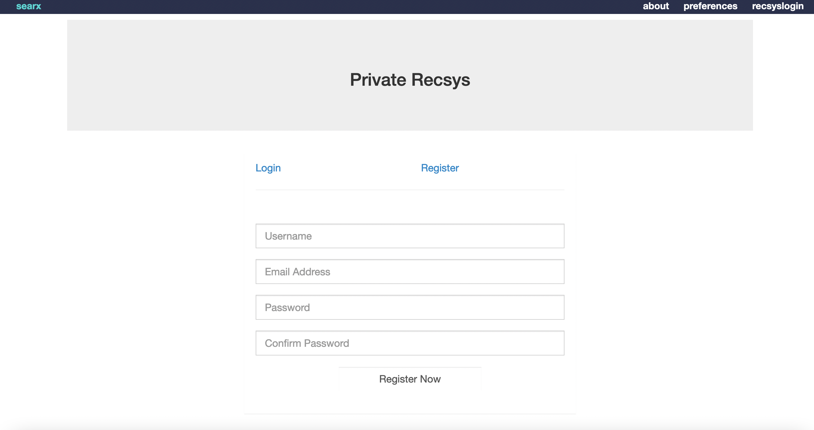
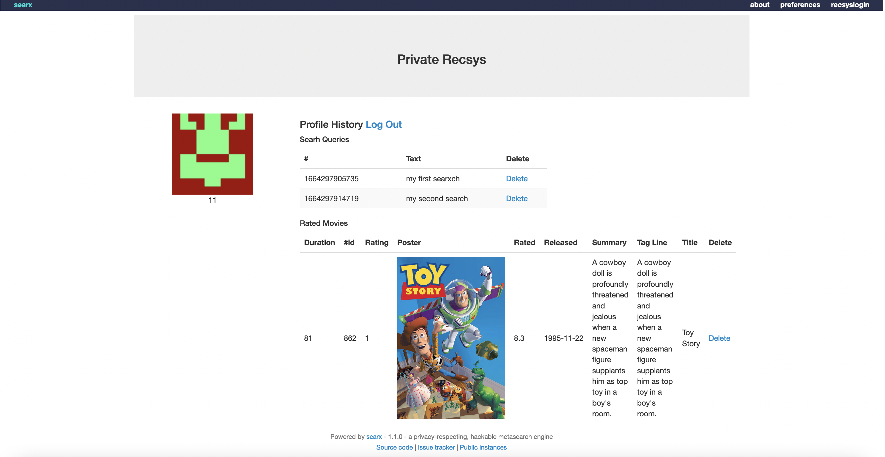

### Hi there 👋

By using any service online, or just by interacting in the Internet you produce data, which you may not realise at the beginning but putting them together can reveal sensitive and private information regarding you and your interests, your thoughts, your intentions. (e.g. movie ratings, medical records, e-mail patterns). 
These data can be useful for improving your online experience, for making sure that you find relevant articles to read, and helpful sources of information but also finding the products you want to buy and visiting the restaurants that match your taste.

There is a need for a way to have an intellligent and efficient internet, while at the same time protect your identity and have your privacy in mind.
Anonymisation techniques, have been used as a method of preserving real identities.. however, research has shown that deanonymization can easily be achived by combining multple sources of information.


## Privacy Preserving Approach 1:  Differential Privacy 
Differential privacy aims to provide means to maximize the accuracy of these statistical queries while minimizing the chances of identifying its records. It introduces noise to real data so that, adding or removing one user to database does not make noticeable difference in the data, thus preventing to identify his/her private information. It is a probabilistic concept, therefore, any differentially private mechanism is necessarily randomized with Laplace mechanism, exponential mechanism etc.

Let ε be a positive real number and A be a randomized algorithm that takes a dataset as input (representing the actions of the trusted party holding the data). The algorithm A is ε-differentially private if for all datasets 𝐷_1 and 𝐷_2 that differ on a single element (i.e., the data of one person), and all subsets S of image of A.


where the probability is taken over the randomness used by the algorithm.

Differential privacy is used in this implementation of the privacy recsys.
### Differencial Privacy Example 1  -  Movie recommendation
For the first test of this approach, a publicly available movie ratings dataset has been considered, and by using the ratings of the users, most similar movies to user’s ratings is determined and a suitable recommendation is done from the ones among them.
The dataset is processed using a graph database (Neo4j), which allows to represent users and movies as nodes and as edges betweeen them the rating a user has given to a movie as well as the similarity between two nodes (in this case two movies).
Below, a snapshot from the represenation of a subset of the database is provided. Orange nodes are anonymized users, Purple nodes are movies and the edges are rating(numeric score) and tag(comment) relations between users and movies.





### DiffPrivacy - Privacy Recsys Test Results
note: please start node4j graph server before running the scripts. 

To measure the error of the recommendation algorithm, and determine the privacy/utility ratio  of the recommendation we undertake a small evaluation based on thequery "What is the number of ratings given to a movie? (movie name as parameter) considering all the data in our dataset" is shown. This is the fundamental question for testing the effectiveness of differential privacy - according to which you should never be able to determine how many users have contributed for this rating and therefore removing all ratings -1 will not return the rating of the one user that remained. The Algorithm is run three times and all results are included to the table. The difference in the results is attributed to the randomness of the algorithm, and the application of differntial privacy as noise.

 

| Movie ID | Actual Rating Count | 	Noisy Rating Count (exp-1)  | 	Noisy Rating Count (exp-2)  | 	Noisy Rating Count (exp-3)  |
|---|---|---|---|---|
| 5 | 51| 61.53068160858365 |  4.14780634816978 |45.74972097598749 |
| 8 | 8 | 23.754713618664823| 4.5610873458316625 | -30.184266258323568 |
| 9 | 16 | 3.8271299734101802| 16.430418771569318 | 5.221803446422436|
| 11| 72 | 80.61785730156829| 68.2613306805804| 90.99006185916669 |
| 210 | 4 | 12.93616669892703| -1.441247061146698 | -26.601274325745656|

- To run this experiment - run the "main.py" within the diffprivacy/differential_privacy folder.
- To test on a small sample use the scripts within the diffprivacy/benchmark folder.
- To produce recommendations on popularity (average rating) and also privacy-presevring collaborative filtering run "main.py" within the diffprivacy/lens folder.

# Web Application
### Start Neo4J and load example data

An example dataset is provided in the /webApplication/data folder. You can add the data to your neo4j database using
```
neo4j-admin load --from 2022-09-07T07\ 58\ 56.655076_e65249b97007729d05e166987a193e0b.dump --database=neo4j --force
```

and then you can start it on command line with 

```
neo4j console
```

or as a background process with
```
neo4j start
```

This will give you the URL that neo4j is active. Typically for localhost is http://localhost:7474/browser/ . Navigate to this and there you can login to explore your database.

## BackEnd - API
First, navigate to the `privaterecsys/pythonProject/webApplication/ ` directory of this project where all the web application components are available.


Then, configure your `flask-api/.env` file to point to your database. 
Make sure to fill your MOVIE_DATABASE_USERNAME , MOVIE_DATABASE_PASSWORD, MOVIE_DATABASE_URL  and SECRET_KEY in the  `flask-api/exportvariables.sh` file. If you are running on localhost, you can use the following example configuration.

```
export SECRET_KEY="super secret guy"
export MOVIE_DATABASE_USERNAME="neo4j"
export MOVIE_DATABASE_PASSWORD="neo4j"
export MOVIE_DATABASE_URL="neo4j://localhost:7687"
```
Credentials for remote testing dataset
```
export SECRET_KEY="super secret guy"
export MOVIE_DATABASE_USERNAME="neo4j"
export MOVIE_DATABASE_PASSWORD="headquarters-mattress-worksheets"
export MOVIE_DATABASE_URL="bolt://3.92.184.29:7687"
```
Then acitvate your environment, install requirements and run the API as follows: 
```
cd flask-api
python3 -m venv venv
source venv/bin/activate
source exportvariables.sh
pip3 install -r requirements.txt
export FLASK_APP=app.py
flask run
```
You will find documentation on how to use the API at <b> http://127.0.0.1:5000/docs </b>


This is an example demonstrating the usage of the API to retrieve similar movies 


### Contributing

The Flask API is located in the `privaterecsys/pythonProject/webApplication/flask-api` folder.
The application code is in the `app.py` file.

##### Create Endpoint

The API itself is created using the [Flask-RESTful](http://flask-restful-cn.readthedocs.io/en/0.3.5/) library.
The API endpoints are documented using Swagger.

To add a new API endpoint there are 3 steps:

1. Create a new Flask-RESTful resource class
2. Create an endpoint method including the swagger docs decorator.
3. Add the new resource to the API at the bottom of the file.

## Frontend
From the pythonProject/webApplicaition directory of this project, set up the app and start it with 
yarn at http://localhost:3000/ . Use the following

```
cd web
yarn 
yarn start 
```

The web application of the privacy recsys will be available at at <b> http://127.0.0.1:300 </b> (in progress) 

You can sign up, login,

You can rate movies in the home screen and then 



Get recommendations appearing in your profile.



## The system has now started to be intergrated within Searx
To run the system you will need to have the a) BackEnd - API running and the b) the searx instance.
### To start the API
```
export SECRET_KEY="super secret guy"
export MOVIE_DATABASE_USERNAME="neo4j"
export MOVIE_DATABASE_PASSWORD="minutes-medicines-voltages"
export MOVIE_DATABASE_URL="bolt://18.207.227.79:7687"
Then acitvate your environment, install requirements and run the API as follows: 
```
```
cd flask-api
python3 -m venv venv
source venv/bin/activate
source exportvariables.sh
pip3 install -r requirements.txt
export FLASK_APP=app.py
flask run
```
### To start Searx, go to the /searx folder in the /pythonProject/webApplication/ and run 

```
cd /pythonProject/webApplication/searx
make run
```

### The system allows you sign up, login and logout and builds a profile of your search queries.

 
Search queries are stored while you are logged in, and you can delete search queries from your account. 



