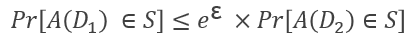

### Hi there 👋

By using any service online, or just by interacting in the Internet you produce data, which you may not realise at the beginning but putting them together can reveal sensitive and private information regarding you and your interests, your thoughts, your intentions. (e.g. movie ratings, medical records, e-mail patterns). 
These data can be useful for improving your online experience, for making sure that you find relevant articles to read, and helpful sources of information but also finding the products you want to buy and visiting the restaurants that match your taste.

There is a need for a way to have an intellligent and efficient internet, while at the same time protect your identity and have your privacy in mind.
Anonymisation techniques, have been used as a method of preserving real identities.. however, research has shown that deanonymization can easily be achived by combining multple sources of information.

## Privacy Preserving Approach 1:  Differential Privacy 
Differential privacy aims to provide means to maximize the accuracy of these statistical queries while minimizing the chances of identifying its records. It introduces noise to real data so that, adding or removing one user to database does not make noticeable difference in the data, thus preventing to identify his/her private information. It is a probabilistic concept, therefore, any differentially private mechanism is necessarily randomized with Laplace mechanism, exponential mechanism etc.

Let ε be a positive real number and A be a randomized algorithm that takes a dataset as input (representing the actions of the trusted party holding the data). The algorithm A is ε-differentially private if for all datasets 𝐷_1 and 𝐷_2 that differ on a single element (i.e., the data of one person), and all subsets S of image of A.

where the probability is taken over the randomness used by the algorithm.

Differential privacy is used in this implementation of the privacy recsys.
### Differencial Privacy Example 1  -  Movie recommendation
For the first test of this approach, a publicly available movie ratings dataset has been considered, and by using the ratings of the users, most similar movies to user’s ratings is determined and a suitable recommendation is done from the ones among them.
The dataset is processed using a graph database (Neo4j), which allows to represent users and movies as nodes and as edges betweeen them the rating a user has given to a movie as well as the similarity between two nodes (in this case two movies).
Below, a snapshot from the represenation of a subset of the database is provided. Orange nodes are anonymized users, Purple nodes are movies and the edges are rating(numeric score) and tag(comment) relations between users and movies.

