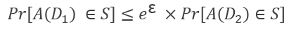
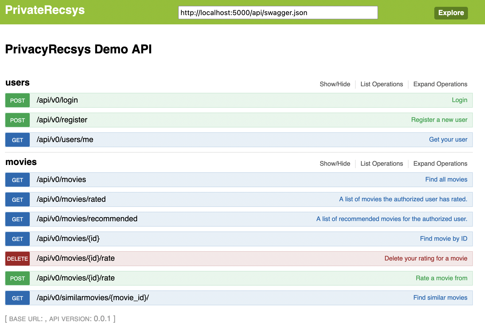

# Welcome to Private Recsys

The PrivacyRecSys project aims to develop an open-source toolkit for delivering accurate recommendations while respecting users' privacy. The toolkit will include ranking and recommendation mechanisms that can assist privacy-focused open source search engines like Searx in producing better recommendations.

# Tasks

## Task 1: Project Setup 
The first task is focused on undertaking an analysis of Searx which will be used to produce the system architecture
document including components analysis. The produced documents will facilitate both the development of the system and its further integration into Searx. 
The [D1.System Architecture](https://github.com/privateRecsys/privaterecsys/blob/gh-pages/Documentation/D1.%20System%20Architecture_%20v1-1.pdf) is made available and will be updated with the updated system architecture, components analysis and sequence diagram by the end of the project. 

## Task 2: Privacy Preserving Recommendations using Differential Privacy

Differential privacy aims to provide means to maximize the accuracy of these statistical queries while minimizing the chances of identifying its records. It introduces noise to real data so that, adding or removing one user to database does not make noticeable difference in the data, thus preventing to identify his/her private information. It is a probabilistic concept, therefore, any differentially private mechanism is necessarily randomized with Laplace mechanism, exponential mechanism etc.

Let ε be a positive real number and A be a randomized algorithm that takes a dataset as input (representing the actions of the trusted party holding the data). The algorithm A is ε-differentially private if for all datasets 𝐷_1 and 𝐷_2 that differ on a single element (i.e., the data of one person), and all subsets S of image of A.

For the first test of this approach, a publicly available movie ratings dataset has been considered, and by using the ratings of the users, most similar movies to user’s ratings is determined and a suitable recommendation is done from the ones among them. The dataset is processed using a graph database (Neo4j), which allows to represent users and movies as nodes and as edges betweeen them the rating a user has given to a movie as well as the similarity between two nodes (in this case two movies). Python Code is provided for calculating the most popular items (noisy average rating) also for making recommendations privacy-preserving collaborative filtering. Code is available in the diffprivacy folder along with movie reviews testing datasets in the dataset folder. 

## Task 3:  Recommender sysstem API
An API has been developed to make the functionality of the private recsys available. The API has been developed as a Python application on the Flask micro web framework. The API enables requests for users and movies. Funcionality registering new users, login and receiving the rating history of the user is provided. Regarding movies, the API provides acess to all movies available in the database, request to receive the movies rated by a particular user, receive movie details via ID, rate a movie, delete a rating for a movie and get similar movies based on content-based private recsys.  The API can be modified and extented to support any item where the user can express a preference about via a numerical score. 

### Support or Contact

Having trouble with PrivateRecsys? Please contact us [contact support](mailto:privaterecsys@gmail.com) and we’ll help you sort it out.

### Acknowledgements

This development was sponsored by NLnet Foundation.
Happy hacking.
